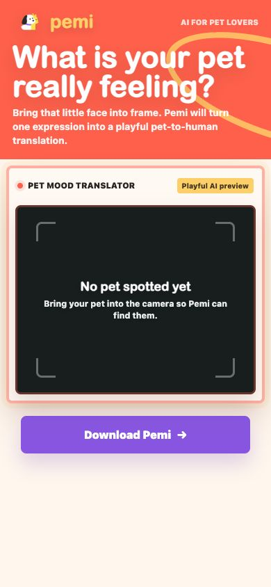
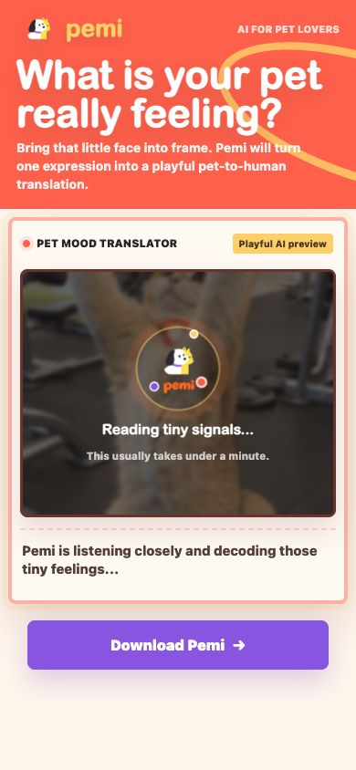
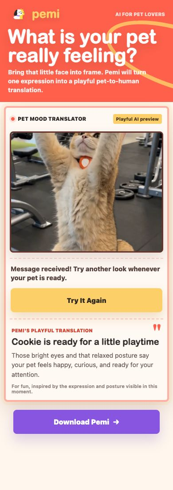

# Pemi — What Is Your Pet Really Feeling?

Pemi is a storybook-style web experience that turns a five-second cat or dog video into a playful pet-to-human interpretation. The browser first checks that a pet is present, records a short clip only after stable detection, keeps the waiting period active with animated birds and tappable pet-knowledge cards, and then reveals the algorithm's reading beside a real frame from the recording.

- **Live demo:** [https://pemiai.cn](https://pemiai.cn)
- **Gitee repository:** [https://github.com/LLLyyy-777/pemi-landing-page](https://github.com/LLLyyy-777/pemi-landing-page)
- **Product baseline documented here:** the current [`main`](https://github.com/LLLyyy-777/pemi-landing-page/tree/main) version
- **Latest visual-polish version:** [`main`](https://github.com/LLLyyy-777/pemi-landing-page/tree/main)

> The live site changes only after a branch is merged and deployed. The visual-polish branch removes the “Playful AI preview” badge, gives the mobile page one continuous lavender-to-cream background, and refines the mobile title size, alignment, and spacing. It does not change the camera or analysis logic described below.

## Product flow

1. **Open and prepare.** The page preloads the ONNX runtime, detector Worker, tracking utilities, and YOLO model. It automatically requests a rear-facing camera when possible and shows a clear loading, permission, or retry state.
2. **Find a pet locally.** A bundled YOLO model runs in the browser and looks only for cat and dog classes. Frames are checked every 500 ms while searching; inference normally runs in a Web Worker, with a main-thread fallback when Worker APIs are unavailable.
3. **Confirm a stable detection.** Pemi waits for at least three positive detections in the latest four frames before recording. This avoids starting from a single unstable frame.
4. **Turn detection into a five-second moment.** Three illustrated birds arrive, follow the detected pet, and Pemi records a five-second silent clip with `MediaRecorder`. At the same time, the page scores candidate still frames using sharpness, detector confidence, and pet area so the final result can use a recognizable frame from the real recording window.
5. **Make the wait useful.** Three randomized dog or cat knowledge cards appear under “While Pemi is thinking.” A tap opens the selected fact in a larger modal so the full text is readable on both mobile and desktop.
6. **Release mobile resources.** As soon as recording is complete, the current memory-optimized version stops the camera tracks, clears the video element, stops detection, terminates the ONNX Worker, and releases a main-thread inference session when one exists. This lowers camera, WebAssembly, SharedArrayBuffer, and inference memory pressure during the longer network wait.
7. **Upload and normalize the video.** The browser validates the clip, requests a presigned upload, and sends the video directly to S3. If the browser produced WebM, the Node server downloads the approved S3 object, converts it to H.264 MP4 with FFmpeg, uploads the converted file, and passes that public URL to the algorithm.
8. **Create and poll the analysis task.** The Node server creates an asynchronous task, polls its result every three seconds, retries retryable API failures, and stops after the configured maximum wait. The browser keeps one request open to `/api/analyze-pet-url` while the server performs this polling.
9. **Reveal the result.** On success, the camera area transitions into a result card containing the algorithm title, readable interpretation, primary mood, an optional mood-distribution donut chart, and the selected recording frame. On failure, Pemi presents a recoverable message and a “Try It Again” action.
10. **Start another reading.** Because the camera and detector were intentionally released during analysis, retrying requests the camera again and reloads the detector before returning to pet search.

| Searching | Waiting | Result |
| --- | --- | --- |
|  |  |  |

## What happens while Pemi is thinking

The waiting state is divided into honest stages instead of presenting a fake percentage or an unreliable completion time.

| Stage | User-facing experience | Work happening behind the interface |
| --- | --- | --- |
| Pet confirmed | Birds arrive and three species-specific knowledge cards appear. | The stable 3-of-4 detection gate has passed. |
| Recording | “Capturing a 5-second moment...” | `MediaRecorder` captures the clip and the app evaluates possible result frames. |
| Upload | “Safely sending your pet's tiny moment...” | The browser obtains a presigned URL and uploads directly to S3. |
| Compatibility preparation | “Preparing this tiny moment for a closer look...” | WebM is converted to H.264 MP4 when required. |
| Algorithm analysis | Three messages rotate every 4.8 seconds: reading signals, following clues, and translating posture and expression. | The Node server creates the task and polls the algorithm until success, failure, or timeout. |

The knowledge cards remain available through recording, upload, conversion, and analysis. Each reading selects three facts from a six-item cat or dog collection. Cards support a full-size dialog, a close button, and backdrop dismissal. The birds provide passive companionship without adding scores, tasks, or extra network requests.

## Experience highlights

- **Local first-stage detection:** the camera feed is evaluated in the browser; a clip is not recorded or uploaded until stable cat/dog detection succeeds.
- **Worker plus fallback inference:** ONNX inference normally runs away from the main UI thread, with a structurally similar main-thread path for browsers that cannot provide Worker camera frames.
- **Deliberate detection gate:** the current baseline uses `0.55` confidence, a `4%` minimum model-frame pet area, and three positive frames out of the most recent four.
- **Mobile camera controls:** Pemi requests the rear camera first. On likely phone devices with multiple cameras, the user can switch front/rear; front-camera preview and coordinates are mirrored, while the rear camera preserves real direction.
- **Pet-following birds:** three SVG birds orbit the detected bounding box. If the pet has not been detected for roughly two seconds during tracking, the birds form a smaller, more translucent searching group.
- **Real recording context:** the final image is selected only from the five-second recording period and is scored using sharpness, confidence, and pet size, with a midpoint fallback.
- **Richer algorithm output:** the server normalizes several possible response shapes and exposes the primary emotion plus an optional distribution rendered as a donut chart.
- **Mobile memory protection:** camera and inference resources are released before upload and analysis, reducing the chance that a memory-constrained mobile browser reloads the page while waiting.
- **Responsive storybook presentation:** desktop uses editorial side illustrations, while mobile keeps the same camera and result journey in a compact single-column layout.
- **Accessible status and motion:** important state text uses live regions, controls have descriptive labels, and `prefers-reduced-motion` suppresses decorative flight and orbit animation.

## Architecture and data flow

```text
Browser
  Camera permission and rear/front selection
    → local YOLO cat/dog inference (ONNX Runtime WebAssembly)
    → stable 3-of-4 detection gate
    → bird tracking + knowledge-card waiting layer
    → 5-second silent MediaRecorder clip + best-frame selection
    → release camera tracks and ONNX detector
    → request presigned upload from the Pemi server
    → direct PUT of MP4/WebM to S3

Pemi Node server
  Optional WebM download from approved S3 origin
    → FFmpeg conversion to H.264 MP4
    → upload converted MP4 to S3
    → create asynchronous algorithm task
    → poll algorithm result
    → normalize title, copy, primary mood, and distribution

Browser
  Replace camera view with the result and selected recording frame
```

The browser never receives the S3 presign-service key or algorithm-service credentials. The Node server keeps those values in environment variables, restricts accepted video types and sizes, validates S3 URLs before server-side downloads, limits JSON/API response sizes, applies network timeouts, and removes temporary transcoding files.

### Front-end state machine

```text
idle
  → requesting-camera
  → loading-model
  → searching
  → recording
  → analyzing
  → success

Any recoverable camera, detector, upload, conversion, or algorithm problem
  → error
  → Try It Again
  → requesting-camera / loading-model / searching
```

### HTTP interfaces

| Endpoint | Purpose |
| --- | --- |
| `POST /api/presign-pet-video` | Accepts a safe filename and `video/mp4` or `video/webm`; returns the presigned S3 upload details and public URL. |
| `POST /api/transcode-pet-video` | Accepts an approved S3 WebM URL; returns the uploaded H.264 MP4 URL. |
| `POST /api/analyze-pet-url` | Accepts the approved video URL; creates the external task, polls it server-side, and returns normalized result content. |

## Technology

- Vanilla HTML, CSS, and JavaScript
- Node.js HTTP server
- `onnxruntime-web@1.27.0`
- Bundled JSEP WASM runtime with one configured inference thread
- YOLO ONNX model for local cat/dog detection
- Web Workers, OffscreenCanvas, Canvas, MediaDevices, and MediaRecorder APIs
- Amazon S3 presigned uploads
- FFmpeg for WebM-to-H.264 MP4 compatibility
- `node:test` for tracking, geometry, camera-direction, and result-frame helpers

The first uncached visit currently downloads an approximately 9.9 MB ONNX model and a 26.8 MB JSEP WASM binary. These assets are local to the site and cached by the server, but slow mobile connections can still require a noticeable warm-up period.

## Run locally

The project requires Node.js 20 or newer, pnpm via Corepack, and a current Safari, Chrome, or Edge browser. A camera is needed for the interactive flow.

```bash
git clone https://gitee.com/wegen_1/landing-page.git
cd landing-page
corepack enable
pnpm install
cp .env.example .env
pnpm dev
```

Open [http://localhost:5174](http://localhost:5174), or the `PORT` configured in `.env`.

Camera access works on `localhost` and secure HTTPS origins. A phone can open a Mac's local-network address to inspect appearance, but mobile camera APIs normally require HTTPS rather than plain `http://192.168.x.x`.

The interface, responsive layout, camera preview, local detector, recording, birds, and knowledge cards can be reviewed without production credentials. Complete upload and algorithm analysis require the S3 and algorithm-service configuration described below.

## Environment configuration

See [`.env.example`](.env.example) for all timeout, retry, authentication-header, and size options.

| Variable | Required | Purpose |
| --- | --- | --- |
| `PORT` | No | Local HTTP port; defaults to `5174`. |
| `S3_PRESIGN_URL` | Full flow | Server-to-server endpoint that returns `upload_url` and `s3_key`. |
| `S3_PRESIGN_API_KEY` | Full flow | Secret used only by the Node server when requesting upload details. |
| `S3_PUBLIC_BASE_URL` | Full flow | Public S3 base URL used to build and validate video URLs. |
| `FFMPEG_PATH` | No | Overrides the bundled `ffmpeg-static` executable. |
| `MAX_VIDEO_BYTES` | No | Maximum accepted download/upload size; defaults to 30 MiB. |
| `MOCK_ALGORITHM` | No | When `true`, returns a local mock result after a successful S3 upload. |
| `ALGORITHM_CREATE_URL` | Production | Creates the asynchronous analysis task. |
| `ALGORITHM_RESULT_URL_TEMPLATE` | Production | Polling URL containing the required `{task_id}` placeholder. |
| `ALGORITHM_API_KEY` | If protected | Algorithm-service credential held only by the Node server. |
| `ALGORITHM_POLL_INTERVAL_MS` | No | Result polling interval; defaults to 3,000 ms. |
| `ALGORITHM_MAX_WAIT_MS` | No | Overall algorithm wait; defaults to 180,000 ms. |
| `ALGORITHM_REQUEST_TIMEOUT_MS` | No | Timeout for each algorithm request; defaults to 45,000 ms. |
| `ALGORITHM_REQUEST_MAX_ATTEMPTS` | No | Retry limit for retryable algorithm requests; defaults to 3. |

Never commit `.env`; it is intentionally ignored by Git.

## Tests and validation

```bash
pnpm test
pnpm check
```

The current main version contains 12 `node:test` cases covering:

- landscape and portrait reverse-letterbox mapping;
- `object-fit: cover` mapping and visible-edge clipping;
- front/rear mirroring and camera-direction toggling;
- phone-device classification;
- bird orbit safety bounds;
- frame sharpness and combined result-frame scoring;
- desktop/mobile result-frame sizing.

Visual changes should additionally be checked at representative phone and desktop widths, with camera permission allowed and denied. The latest Codex visual-polish pass was reviewed at `390 × 844` and `1440 × 900`, followed by the 12 tests and `git diff --check`.

## How Codex was used to build Pemi

Codex was used as a development and product-iteration partner. It is not a runtime dependency of the shipped website, does not perform the pet analysis shown to end users, and does not receive live camera video as part of the deployed experience.

### Provenance of this development record

The original Codex conversations for every historical version are not all available in this workspace. This section is therefore a transparent reconstruction based on repository history, implementation details, code comments, the product owner's account that the recent iterations were Codex-assisted, and the verified work completed for the latest visual-polish version. It describes the working method and concrete outcomes without presenting invented chat messages as a verbatim log.

### The collaboration loop

1. **The product owner supplied intent in plain language.** Requests arrived as bug descriptions, desired user journeys, annotated mobile screenshots, and visual references rather than as low-level implementation instructions.
2. **Codex grounded each task in an exact Git version.** It checked the Gitee remote and commit hash, read the real HTML/CSS/JavaScript/Node flow, and separated new work from unrelated local changes with a clean branch or worktree.
3. **Codex translated product intent across the stack.** A waiting-state request could require DOM structure, responsive styling, browser state transitions, camera lifecycle work, server polling, and failure copy; Codex traced and updated those connected layers together.
4. **The product owner retained the important decisions.** The human chose the visual direction, which interactions belonged in the first release, how playful the wait should feel, and whether a proposed change matched the Pemi brand.
5. **Codex verified before handoff.** It ran pure-function tests and syntax/diff checks, served the site locally, inspected representative mobile and desktop layouts, and pushed isolated review branches instead of silently changing shared `main`.

### Codex-assisted product work represented in the current version

- Shaped the responsive storybook landing page from visual direction while preserving a functional camera and result surface.
- Connected browser APIs for camera permission, mobile camera switching, front-camera mirroring, recording, Canvas snapshots, Worker inference, and retry states.
- Implemented the pet-detection gate and the coordinate helpers that keep birds aligned with the camera preview.
- Expanded a long algorithm wait into explicit recording, upload, optional conversion, and analysis stages with rotating truthful copy.
- Added randomized species-specific knowledge cards and a readable modal so the wait contains useful, optional interaction.
- Added primary-mood display and a distribution donut chart while accepting multiple algorithm response shapes.
- Diagnosed mobile memory pressure and implemented the current main version's lifecycle change that stops camera tracks and releases the ONNX detector before the long network phase.
- Iterated through local browser previews and Git branches to refine mobile presentation without disturbing working product logic.

### Verified example: the latest visual-polish pass

For the latest visual-polish version, the product owner supplied an annotated phone screenshot and three visual requirements. Codex then:

1. verified that Gitee `main` contained the latest product baseline;
2. created a clean `codex/mobile-visual-polish` worktree and branch from that version;
3. removed the “Playful AI preview” element from the shared markup;
4. moved the mobile gradient to the common page shell so the title and camera sections form one continuous surface;
5. removed the mobile divider, centered and reduced the title, and increased title-to-body spacing;
6. checked computed styles and captured local previews at phone and desktop sizes;
7. ran all 12 tests and Git diff validation;
8. committed the two-file visual update and pushed the review branch to Gitee.

### Responsibility split

| Product owner | Codex |
| --- | --- |
| Defines audience, brand, product intent, and acceptance criteria. | Inspects the exact code/version and proposes an implementation grounded in it. |
| Chooses between design and scope tradeoffs. | Implements approved front-end/server changes and explains consequences. |
| Reviews the real phone and desktop experience. | Runs local previews, automated checks, and evidence-based debugging. |
| Approves merging and deployment. | Creates reviewable commits/branches and reports what has or has not been pushed. |

## Key product and engineering decisions

| Challenge | Decision | Why |
| --- | --- | --- |
| A single detector frame can be noisy | Require three positive frames in the latest four | Reduces accidental recordings without asking the user to press a capture button. |
| Analysis can take much longer than recording | Show real pipeline stages, orbiting birds, and optional knowledge cards | Keeps the experience active without fake progress or an unreliable ETA. |
| Mobile browsers are sensitive to camera and WASM memory pressure | Stop tracks and terminate/release inference before upload and analysis | Frees the largest live resources during the longest wait. |
| Different browsers record different formats | Accept MP4/WebM and transcode WebM to H.264 MP4 on the server | Gives the algorithm a more consistent input while keeping broad browser support. |
| Upload credentials must not enter the browser bundle | Issue short-lived presigned details and upload directly to S3 | Keeps secrets server-side and avoids proxying the original clip through the app server. |
| A result should feel connected to the captured moment | Show the best-scored frame from the real five-second recording | Makes the interpretation recognizable and avoids a generic result screen. |
| Algorithm payloads may evolve | Normalize several title, copy, mood, and distribution shapes on the server | Keeps front-end rendering stable while the analysis service changes. |

## Privacy, limitations, and responsible framing

- Pemi currently recognizes cats and dogs only.
- The first-stage pet check runs locally. After stable detection, the five-second silent clip is uploaded to the configured S3 service for analysis.
- Upload retention, deletion, access control, and regional storage depend on the configured S3 policy and should be documented before production use.
- The result is a playful interpretation inspired by visible expression and posture; it is not veterinary, behavioral, or medical advice.
- Camera permission and a secure context are required on mobile. Plain local-network HTTP is suitable for layout review but normally cannot access a phone camera.
- The current main version reduces accidental reload risk by releasing memory, but it does not persist an in-progress task or completed result across a manual page refresh. Refreshing restarts the camera journey.
- The first uncached detector load is large and may be slow on mobile networks.
- Production credentials are not included in the repository and must remain outside Git.

## Release workflow

1. Review `codex/mobile-visual-polish` on mobile and desktop.
2. Merge the approved branch into `main` through Gitee.
3. Run `pnpm test` and `pnpm check` on the merged commit.
4. Deploy the complete repository revision together so HTML and CSS remain in sync.
5. Verify the live site over HTTPS with a real phone: permission, rear/front switching, pet detection, recording, every wait stage, result rendering, retry, and denial/error paths.
